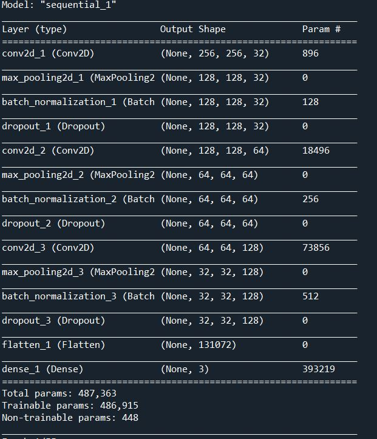

# Real time ROCK PAPER SCISSORS GAME
Hey guys this is my first project using OpenCV.It is basically a game of rock,paper,scissors against a computer.I first started with collecting images with rock,paper,scissors to train my model and luckly I found a dataset of 2500 images with separte training and testing images of rock,paper and scissors then I started cleaning my data and preprocessing all the images into numpy array of pixel values once that was done then I started with training the model : 

Once the model was trained it gave me around 97% accuracy which was really good.
Then I got started with the game file in which I have to use OpenCV to read my webcam,draw bounding box to read my hand and basically put all my code together and start predicting the real time frames on my hand movement.
Soo ya this is basically it!
If you guys wanna try it just download the finalmodel.h5 file and run rps.py file on your system.
# THANKYOU
# SUPPORT AND FEEDBACKS
INSTAGRAM - @aadarshcodes
EMAIL - aadarsh.s2019@vitbhopal.ac.in / saadarsh362@gmail.com

